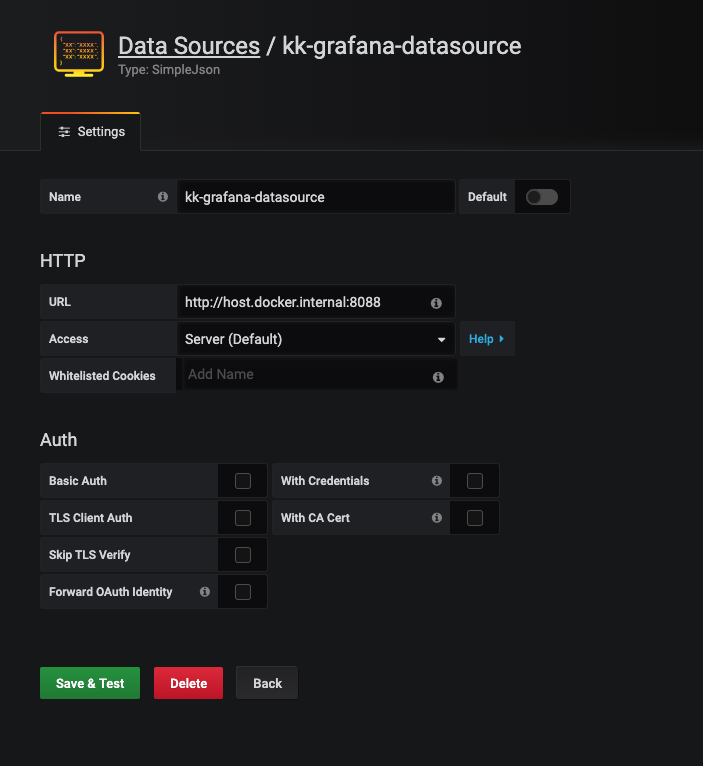

English | [简体中文](README_CN.md)
# wuhan2020-grafana

### Updated April 3,2020

China will hold a national mourning on April 4,2020 for martyrs who died in the fight against COVID19 and for compatriots who died from the disease, the State Council announced.

## Summary

Use Grafana to display COVID-19 data


## Quick Start

Requires **Python 3.6** or later

```bash
git clone https://github.com/sunny0826/wuhan2020-grafana.git
cd wuhan2020-grafana
pip install -r requestment
python index.py
```

## Run with docker

install [Docker](https://www.docker.com/products/docker-desktop)

### Pull Image

```bash
docker pull guoxudongdocker/feiyan-datasource
```

### Run Image

```bash
docker run -d --name datasource -p 8088:3000 guoxudongdocker/feiyan-datasource 
```

### Stop Image

```bash
docker stop grafana
```

## Import Grafana

Runing Grafana，And need install [SimpleJson](https://grafana.com/grafana/plugins/grafana-simple-json-datasource/installation) plugin.

### Use docker runing Grafana(Recommend)

```bash
docker run \
        -d --name grafana  -p 3000:3000 \
        -e "GF_SECURITY_ADMIN_PASSWORD=qwe123" \
        -e "GF_INSTALL_PLUGINS=grafana-simple-json-datasource" \
        grafana/grafana grafana 
```

### Add DataSource 

Select SimpleJson as the DataSource and fill in the `Name` and `URL`:`http://host.docker.internal:8088`




### Import Dashboard

Click on `Upload.json file`


select `wuhan2020-grafana/dashboard.json`

## Deploy on K8S

```bash
kubectl apply -f deploy.yaml
```