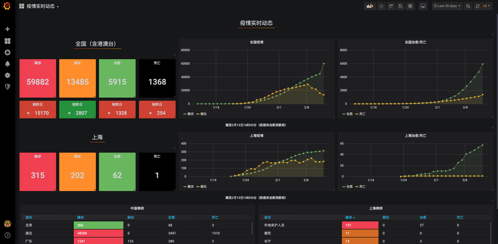

# wuhan2020-grafana
使用 Grafana 展示疫情实时动态



## 快速开始

需要 **Python 3.6** 以上版本吧

```bash
git clone https://github.com/sunny0826/wuhan2020-grafana.git
cd wuhan2020-grafana
pip install -r requestment
python index.py
```

## 在本地使用 docker 容器运行

安装[Docker客户端](https://www.docker.com/products/docker-desktop)

### 拉取镜像

```bash
docker pull guoxudongdocker/feiyan-datasource
```

### 运行镜像

```bash
docker run -d --name datasource -p 3000:8088 guoxudongdocker/feiyan-datasource 
```

### 停止镜像

```bash
docker stop grafana
```

## 导入 Grafana

启动 Grafana，需要安装 [SimpleJson](https://grafana.com/grafana/plugins/grafana-simple-json-datasource/installation) 插件

### 使用 docker 镜像启动（推荐）

```bash
docker run \
        -d --name grafana  -p 3000:3000 \
        -e "GF_SECURITY_ADMIN_PASSWORD=qwe123" \
        -e "GF_INSTALL_PLUGINS=grafana-simple-json-datasource" \
        grafana/grafana grafana 
```

### 添加数据源 

选择 SimpleJson 为数据源，填入名称和服务地址 `http://host.docker.internal:8088`


### 导入 dashboard

点击 `Upload.json file`


选择 `wuhan2020-grafana/dashboard.json`

## K8S 部署

直接使用 `yaml` 文件即可部署

```bash
kubectl apply -f deploy.yaml
```