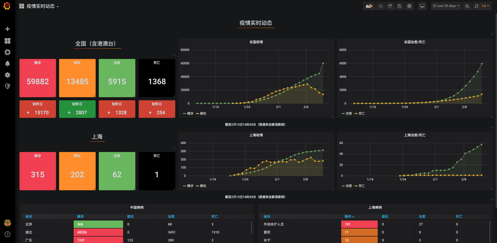
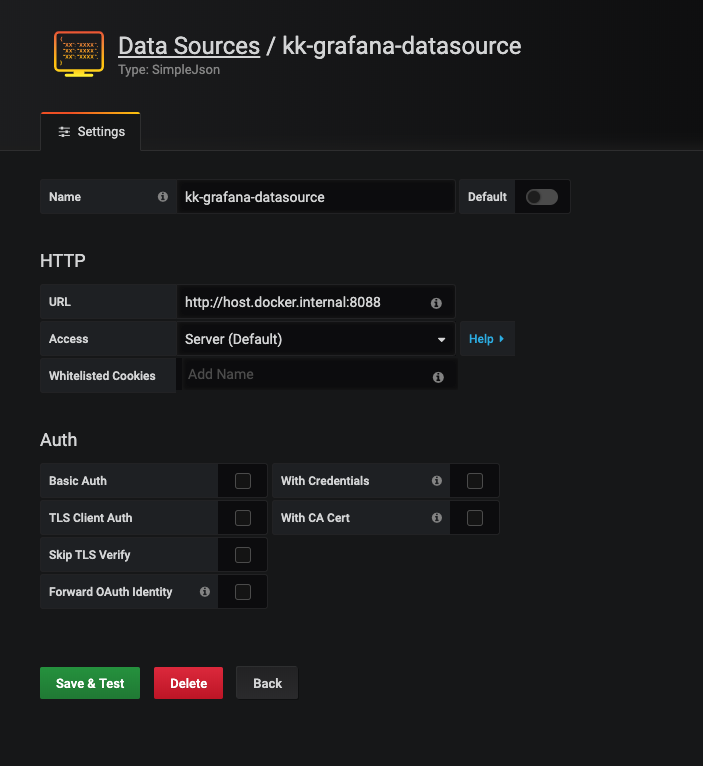
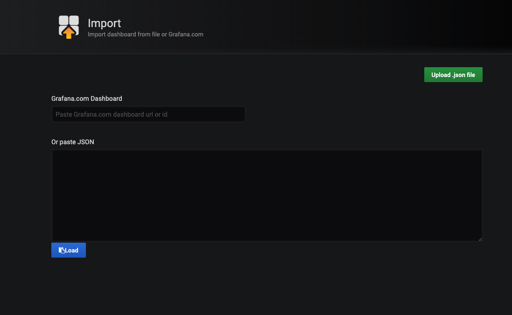

[English](README.md) | 简体中文
# wuhan2020-grafana

### 2020年4月3日更新

为表达全国各族人民对抗击新冠肺炎疫情斗争牺牲烈士和逝世同胞的深切哀悼，2020年4月4日将举行全国性哀悼活动。在此期间，全国和驻外使领馆下半旗哀悼，全国停止公共娱乐活动。4月4日10时起，全国人民默哀3分钟，汽车、火车、舰船鸣笛，防控警报鸣响。

目前武汉已经重启，各省支援武汉的医疗人员纷纷凯旋。向奋斗在抗击疫情一线的工作人员致敬，向在抗击疫情期间牺牲的工作人员表示哀悼。

## 简介
使用 Grafana 展示疫情实时动态



## 快速开始

需要 **Python 3.6** 以上版本

```bash
git clone https://github.com/sunny0826/wuhan2020-grafana.git
cd wuhan2020-grafana
pip install -r requestment
python index.py
```

## 在本地使用 docker 容器运行

安装[Docker客户端](https://www.docker.com/products/docker-desktop)

### 拉取镜像

```bash
docker pull guoxudongdocker/feiyan-datasource
```

### 运行镜像

```bash
docker run -d --name datasource -p 8088:3000 guoxudongdocker/feiyan-datasource 
```

### 停止镜像

```bash
docker stop grafana
```

## 导入 Grafana

启动 Grafana，需要安装 [SimpleJson](https://grafana.com/grafana/plugins/grafana-simple-json-datasource/installation) 插件

### 使用 docker 镜像启动 Grafana（推荐）

```bash
docker run \
        -d --name grafana  -p 3000:3000 \
        -e "GF_SECURITY_ADMIN_PASSWORD=qwe123" \
        -e "GF_INSTALL_PLUGINS=grafana-simple-json-datasource" \
        grafana/grafana grafana 
```

### 添加数据源 

选择 SimpleJson 为数据源，填入名称和服务地址 `http://host.docker.internal:8088`




### 导入 dashboard

点击 `Upload.json file`



选择 `wuhan2020-grafana/dashboard.json`

## K8S 部署

直接使用 `yaml` 文件即可部署

```bash
kubectl apply -f deploy.yaml
```